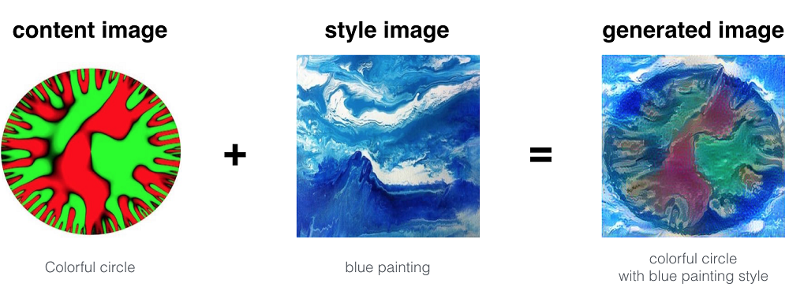

# Neural-Style-Transfer 
(Coursera CNN Course)

Neural Style Transfer (NST) is one of the most fun techniques in deep learning. As seen below, it merges two images, namely: a "content" image (C) and a "style" image (S), to create a "generated" image (G).

The generated image G combines the "content" of the image C with the "style" of image S.

For more detail checkout Jupyter notebook https://github.com/ashu098/Neural-Style-Transfer/blob/master/Art_Generation_with_Neural_Style_Transfer_v3a-checkpoint.ipynb
